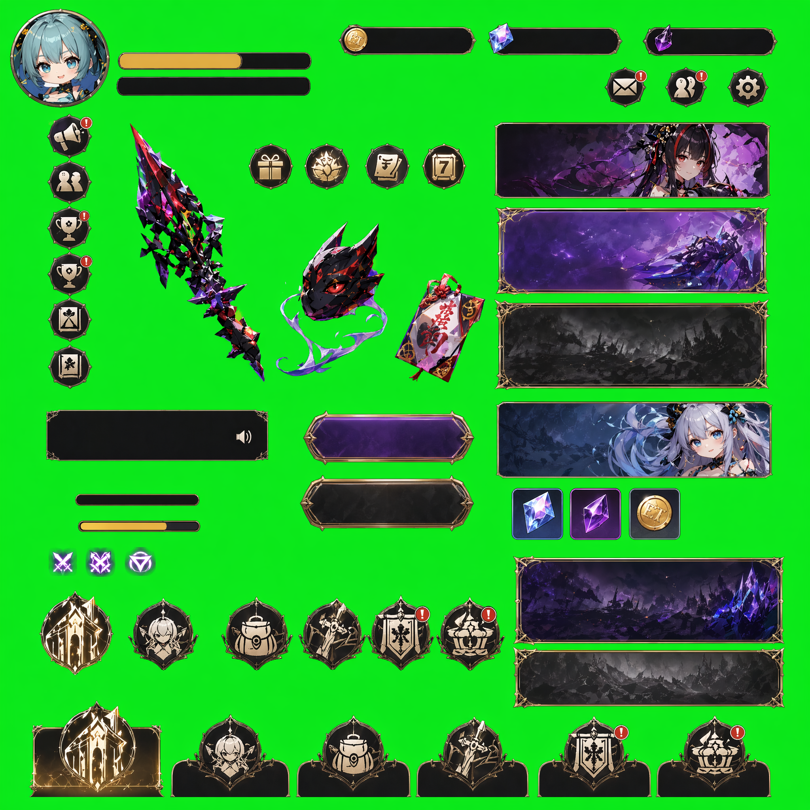

# SpeedSlicer

A browser-based tool for extracting UI elements from game sprite sheets with solid-color backgrounds. No installation required — just open `index.html` in your browser.



## Features

- **Auto background detection** — Samples the four corners of the image to detect the background color
- **HSV hue-based keying** — Professional-grade chroma keying that targets the background hue without damaging whites, grays, or dark elements
- **Despill** — Removes color contamination from edges (green fringing, blue spill, etc.)
- **Auto element detection** — Connected Component Labeling automatically finds and boxes each UI element
- **Auto-merge overlapping boxes** — Nearby elements are merged into larger boxes to avoid fragmentation
- **Interactive preview** — Zoom, pan, drag/resize boxes, add new boxes, delete unwanted ones
- **Batch export** — Export individual PNGs or download all as a ZIP file
- **Undo (Ctrl+Z)** — Up to 50 steps of undo history
- **Save/Load settings** — Export and import your parameter presets as JSON

## Quick Start

1. Open `index.html` in a modern browser (Chrome, Edge, Firefox)
2. Drag & drop your sprite sheet onto the canvas (or click to select a file)
3. The tool automatically detects the background color and extracts elements
4. Adjust parameters if needed, then export

## How It Works

### Step 1: Load Image

Drag and drop an image with UI elements on a solid-color background (green, blue, or any color). The tool auto-detects the background color from the corner pixels.

### Step 2: Background Removal (HSV Keying)

The tool converts each pixel to HSV color space and compares its **hue** against the detected background hue:

| Parameter | Description | Default |
|-----------|-------------|---------|
| Hue Inner | Hue angle within this range = fully transparent | 15° |
| Hue Outer | Hue angle beyond this range = fully opaque | 40° |
| Saturation Guard | Low-saturation pixels (whites/grays) are protected | 15% |
| Value Guard | Dark pixels (blacks/shadows) are protected | 10% |
| Despill Strength | How aggressively to remove background color bleed from edges | 100% |
| Anti-alias Distance | Smooth edge transitions | 3px |

**Why HSV instead of RGB?**  
RGB distance treats all channels equally, so a white pixel and a light-green pixel can have similar distances from green. HSV separates *hue* (color) from *saturation* (intensity) and *value* (brightness), allowing precise targeting of the background color without damaging non-green content.

### Step 3: Element Detection

After background removal, the tool uses **Connected Component Labeling (CCL)** — a two-pass algorithm with Union-Find — to identify groups of connected non-transparent pixels. Each group gets a bounding box.

Overlapping or very close bounding boxes are automatically merged using a configurable distance threshold.

### Step 4: Preview & Adjust

- **Zoom**: Mouse scroll wheel
- **Pan**: Click and drag on empty space
- **Select**: Click on a bounding box
- **Move**: Drag a selected box
- **Resize**: Drag corner handles
- **Add new box**: Click the `+` button, or Shift + drag
- **Delete**: Select a box and press `Delete`, or right-click > delete
- **Merge**: Right-click on overlapping boxes to merge manually
- **Undo**: `Ctrl+Z` (up to 50 steps)

### Step 5: Export

- Click an individual download button to export a single element as PNG
- "Export Selected" exports checked elements as a ZIP
- "Export All" exports everything as a ZIP
- Adjustable padding around each exported element

## Samples

Example input images are included in the `samples/` folder:

| File | Description |
|------|-------------|
| `sample-dark-ui.png` | Dark-themed game UI with icons, panels, progress bars, badges, and character art on green screen |
| `sample-knight-ui.png` | Blue knight-themed UI with character portrait, panels, icons, and decorative frames on green screen |

## Tech Stack

- **Pure frontend** — HTML + CSS + Vanilla JavaScript, no build tools
- **Canvas 2D API** — Pixel-level image processing with `getImageData`
- **JSZip** — Client-side ZIP file generation for batch export
- **Zero dependencies** — No npm, no frameworks, just open the HTML file

## File Structure

```
SpeedSlicer/
├── index.html            # Single entry point
├── css/
│   └── style.css         # Dark theme styling
├── js/
│   ├── app.js            # Main application wiring
│   ├── image-loader.js   # File input → ImageData
│   ├── bg-detector.js    # Corner sampling background detection
│   ├── element-slicer.js # HSV keying, CCL, overlap detection
│   └── ui-controller.js  # Canvas rendering & interactions
├── lib/
│   └── jszip.min.js      # ZIP library
├── samples/              # Example input images
└── test-file/            # Original test files
```

## License

MIT
