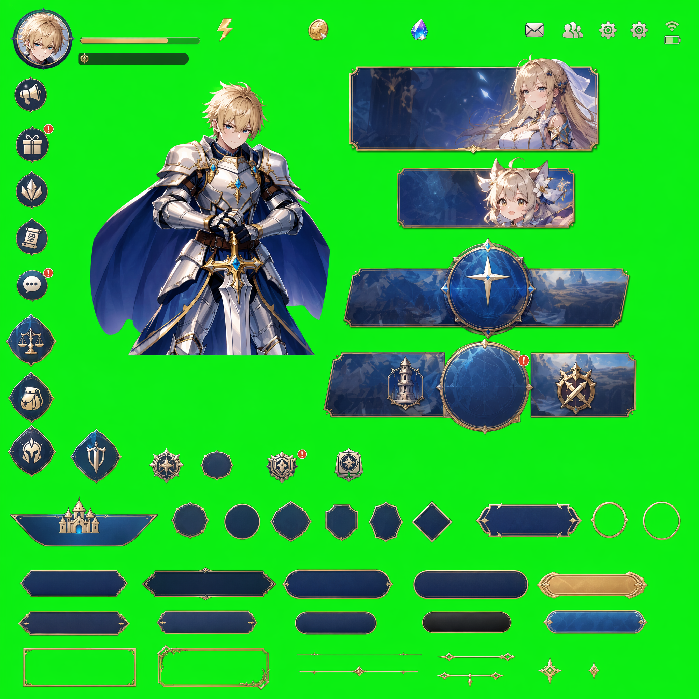
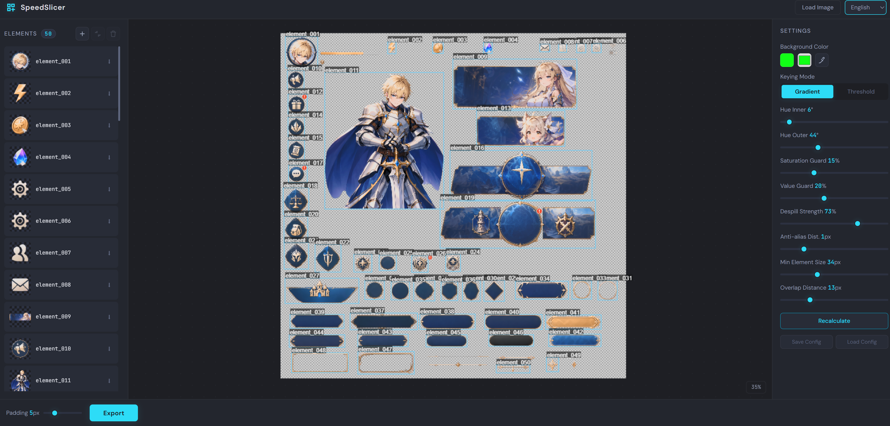

# SpeedSlicer

**Instantly extract every UI element from a sprite sheet. Drop an image, get transparent PNGs.**

---

### Input


### SpeedSlicer at work


### Output
50 individual transparent PNGs, exported in one click. ([Download sample output](samples/output-elements.zip))

---

## Why SpeedSlicer?

Game artists and developers constantly deal with sprite sheets — dozens of UI elements packed onto a single colored background. Manually cutting each one in Photoshop is tedious and slow.

**SpeedSlicer automates the entire process:**

1. **Drop** your sprite sheet
2. **Background is removed** automatically using professional HSV chroma keying
3. **Every element is detected** and individually boxed
4. **Export** all elements as transparent PNGs in a single ZIP

What used to take 30+ minutes now takes seconds.

## Key Features

| Feature | Description |
|---------|-------------|
| **Auto background detection** | Samples corner pixels to find the key color |
| **HSV chroma keying** | Targets hue precisely — whites, grays, and darks stay intact |
| **Despill** | Removes color bleeding from edges (no more green fringing) |
| **Pixel-mask export** | Overlapping bounding boxes? Each PNG only contains its own pixels |
| **Shift+click multi-select** | Photoshop-style selection for batch merge or delete |
| **Ctrl+Z undo** | Up to 50 steps |
| **i18n** | Auto-detects language: English, 繁體中文, 简体中文, 日本語, 한국어 |
| **Save/Load config** | Export your settings as JSON, reuse across sessions |
| **Zero JS dependencies** | Pure HTML/JS/CSS. No npm install, no build step |

---

## Requirements

SpeedSlicer runs entirely in the browser — no build, no npm install. However, because the app uses **ES modules** (`import` statements), browsers block it under the `file://` protocol, so **a tiny local HTTP server is required** (any one of the options below will do).

### Browser
A modern evergreen browser (last ~3 years):
- Chrome / Chromium 89+
- Edge 89+
- Firefox 89+
- Safari 14+

Required browser APIs: ES modules, Canvas 2D, `File API`, `Blob`, `URL.createObjectURL`, drag-and-drop.

### Local server runtime (pick ONE)

| Option | Version | How to check |
|---|---|---|
| **Python 3** | 3.x | `python --version` |
| **Node.js** | any LTS (14+) | `node --version` |

> Most developer machines already have one of these. If not:
> - Python: <https://www.python.org/downloads/>
> - Node.js: <https://nodejs.org/>

No additional packages need to be installed — Python's built-in `http.server` or `npx http-server` (downloaded on first use) is enough.

---

## Quick Start

### Windows — one-click launcher

Double-click **`start.bat`** in the project root.

The script will:
1. Auto-detect Python (`python` → `py`) or fall back to Node.js (`npx http-server`)
2. Start a local HTTP server on port **8000**
3. Open your default browser to <http://localhost:8000/index.html>

To stop the server, press `Ctrl+C` in the console window or just close it.

> Port 8000 already taken? Edit the `PORT=8000` line at the top of `start.bat`.

### macOS / Linux — one-liner

```bash
# Option A: Python 3
python3 -m http.server 8000

# Option B: Node.js
npx http-server -p 8000 -c-1
```

Then open <http://localhost:8000/index.html> in your browser.

### Any platform — via VS Code

Install the **Live Server** extension, right-click `index.html` → *Open with Live Server*.

---

## How to Use

**Load image** — drag & drop or click "Load Image" in the top bar.

**Adjust if needed** — tweak the right panel sliders:
- *Hue Inner/Outer* — how aggressively to key the background
- *Saturation/Value Guard* — protect whites and darks from being keyed
- *Despill Strength* — remove edge color contamination
- *Min Element Size* — filter out noise

**Edit elements** — on the canvas:
- Click to select, Shift+click for multi-select
- Drag to move, corner handles to resize
- `+` button or Shift+drag on empty space to add a box
- Delete key to remove selected elements
- Merge button to combine selected elements

**Export** — click the export button. Get a ZIP containing:
- `_full_transparent.png` — the entire image with background removed
- Individual PNGs for every detected element

---

## Tech Stack

Pure frontend. No build tools. No frameworks.

- Canvas 2D API for pixel processing
- Connected Component Labeling for element detection
- JSZip (bundled under `lib/`) for client-side ZIP generation

## Project Structure

```
SpeedSlicer/
├── index.html          # Entry point
├── start.bat           # Windows quick-launcher
├── css/                # Styles
├── js/                 # ES modules (app, slicer, UI, i18n, ...)
├── lib/                # Bundled JSZip
└── samples/            # Demo input / screenshot / output
```

## License

MIT
